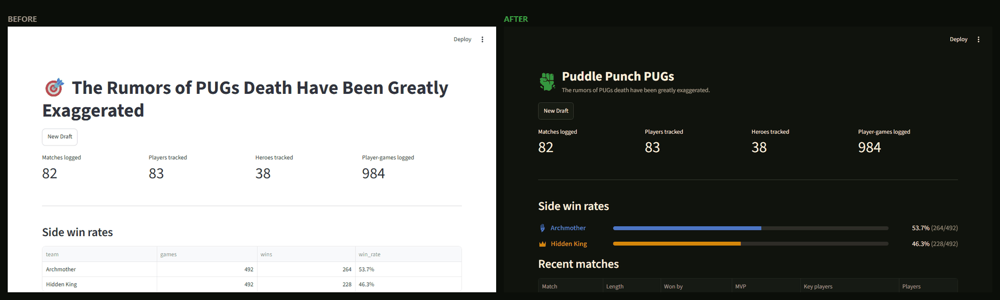
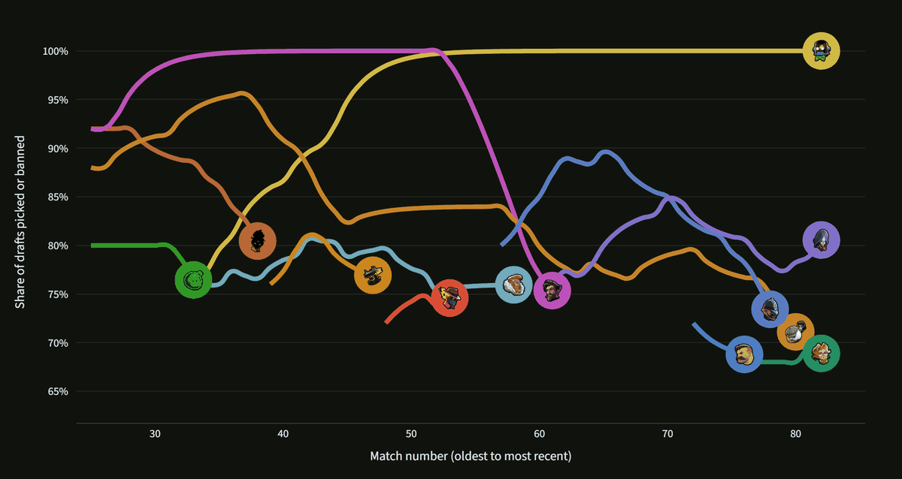

# Deadlock PUG Stats Tracker



## Run it
```
pip install -r requirements.txt
streamlit run Home.py
```

## Structure
- `data/*.json` — your data (matches, players, heroes, rank history). Edit by hand or through the app.
- `utils/data_io.py` — load/save helpers
- `utils/stats.py` — all win rate / ban rate / pick rate / MVP calculations, computed live from matches.json
- `pages/` — the 10 pages, browsing first and the three that write to `data/` last:
  Match Log, Player, Hero Summary, Leaderboard, Player Cards, Head to Head, Friendship Buff,
  then Add Match, Add Player/Hero, Player Ranks
- `backfill_match_dates.py` — fills each match's `date` from the API's `start_time` (resumable; see **Match dates** below)
- `utils/theme.py` — the game's palette, plus the contrast rules that decide when a hero color is safe to show
- `utils/ui.py` — shared page furniture: the header mark, hero portraits, side sigils, award trophies
- `assets/` + `data/palette.json`, `data/hero_visuals.json` — art and colors vendored from the Deadlock assets API
- `.streamlit/config.toml` — the app theme, using the game's own colors
- `fetch_deadlock_assets.py` — re-run to refresh vendored art and colors when Valve adds or reworks heroes
- `convert_csv.py` — the one-time import script that built data/*.json from your old Google Sheet CSVs (kept for reference, not needed to run the app)

Your 82 historical matches, 83 players, and 38 heroes are already imported.

## Art and theming

All art and color come from the community [Deadlock assets API](https://api.deadlock-api.com),
vendored into the repo so no page render needs the network. Refresh it with:

```
python fetch_deadlock_assets.py
```

That pulls each hero's 128px portrait and official color, the two side sigils (the Hidden King's
crown and the Archmother's keyhole hand), the post-game award trophies, Viscous' Puddle Punch
ability icon — the group's mark — and the subset of the game's named colors the theme uses.



One thing worth knowing before changing colors: the game tunes its hero colors for a lit 3D
scene, and flat on a dark page 7 of the 38 fall below a 3:1 contrast ratio, where readable text
wants 4.5:1. `utils/theme.py` lifts lightness until a color clears an actual contrast target,
keeping the hue so heroes stay tellable apart. Get hero colors from `theme.hero_color` /
`theme.hero_text_color` rather than reading `hero_visuals.json` directly.

## Match dates

Matches carry a `date`, taken from the API's `start_time` and converted to **US Eastern** before
the calendar date is read off it. That conversion is the whole point: the group plays evenings,
sessions run past midnight UTC, and a UTC date puts a Sunday night PUG on Monday. `utils/dates.py`
holds the one definition, used by both the backfill and the Add Match form, so they cannot drift.

To fill in matches that are still undated:

```
python backfill_match_dates.py
```

It only asks about matches whose date is missing and saves after each one, so it is safe to
re-run and safe to interrupt. It is also slow by default, for a reason worth knowing: the API
serves a match from its own cache at 100 requests/10s, but falls back to asking Steam at **3 per
hour, per IP** — and our older PUGs are custom lobbies that never entered the API's database, so
they are all on the slow path. An API key raises that to 300/hour:

```
DEADLOCK_API_KEY=... python backfill_match_dates.py
```

## Ideas / backlog
See [IDEAS.md](IDEAS.md) for the running shortlist of improvements, grouped by effort.
